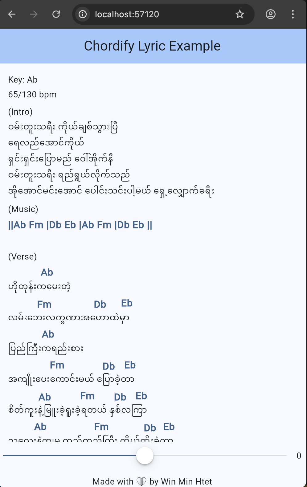

# 🎶 chordify_lyrics

**A Flutter widget package to parse, display, and transpose chorded lyrics** — perfect for music, karaoke, chord sheet, and worship apps.

---

## ✨ Features

- 🎸 Parse lyrics with embedded chords like `[C]I [G]love [Am]you`
- 📐 Automatically aligns chords above lyrics
- 🔁 Transpose chords up/down with `transpose`
- 🔘 Tappable chords with custom actions
- 🎨 Fully customizable styling and layout

---

## 📦 Installation

Add to your `pubspec.yaml`:

```yaml
dependencies:
  chordify_lyrics: ^1.0.0
```

Then run:

```bash
flutter pub get
```

---

## 🚀 Usage

```dart
import 'package:chordify_lyrics/chordify_lyrics.dart';

int transpose = 0;

ChordifyLyricsWidget(
  transpose: transpose,
  rawChordText: rawChordLyric,
  chordLyricsSpacing: 0.1,
  onChordTap: (chord) {
    ScaffoldMessenger.of(context).showSnackBar(
      SnackBar(content: Text(chord)),
    );
  },
)
```

---

## 🎼 Example Input (rawChordText)

```dart
String rawChordText = """
(Chorus)
You are my s[G]unshine, my only sunshine
You make me h[C]appy
When skies are g[G]rey
You’ll never k[C]now dear
How much I [G]love you
Please don’t take my suns[D]hine [G]away
""";
```

> The widget will automatically align `[Ab]`, `[Fm]`, `[Db]`, etc. above each lyric line and support real-time transposition.

---

## 🔁 Transposing Chords

Use the transpose to transpose the key dynamically:

```dart
ChordifyLyricsWidget(
  transpose: transpose,
  ........ : .....
)
```

---

## 🎨 Customization Options

| Prop                 | Description                                          |
| -------------------- | ---------------------------------------------------- |
| `transpose`          | Optional to dynamically transpose chords             |
| `onChordTap`         | Callback when a chord is tapped                      |
| `chordStyle`         | `TextStyle` for chords                               |
| `lyricStyle`         | `TextStyle` for lyrics                               |
| `chordBuilder`       | Custom widget builder for each chord                 |
| `chordLyricsSpacing` | Space between chord and lyric (default: `8.0`)       |
| `scrollController`   | Optional `ScrollController` for scroll customization |

---

## 📸 Screenshots



---

## 💡 Tip

Use this package to build your own:

- 🎤 Karaoke app
- 📖 Songbook or chord sheet
- 🎹 Music education tool
- ⛪ Worship setlist app

---

## 🙌 Contributing

Feel free to open issues or submit PRs to add features, fix bugs, or improve docs!

---

## 📄 License

MIT © Win Min Htet
